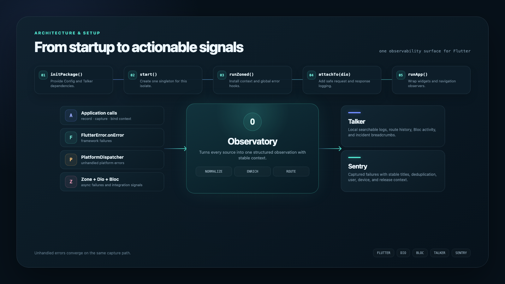
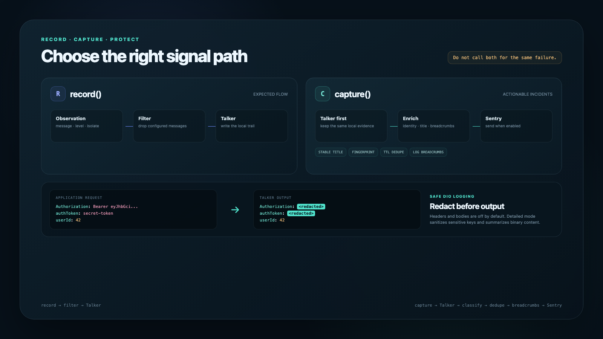
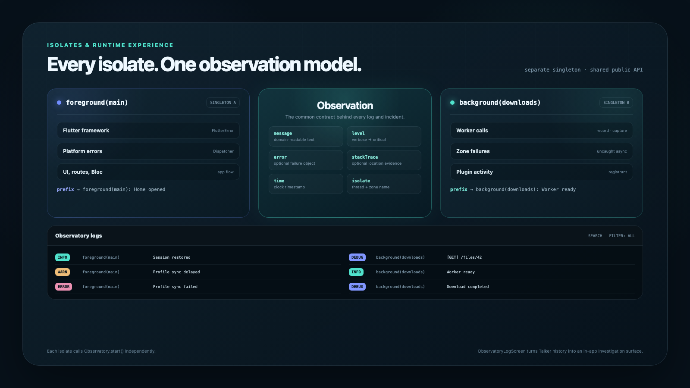

# observatory

A Flutter package for incident investigation: isolate-aware Talker logs,
Sentry capture, and safe Dio redaction. After `Observatory.start`, call
`record` and `capture` from anywhere in the isolate.



## Features

- Talker logs with isolate prefixes (`foreground(main)`)
- Sentry capture with stable titles, dedupe, and log breadcrumbs
- Safe Dio logging with header/body redaction
- Uncaught errors from `runZoned`, Flutter, and platform hooks
- Bloc observer and an in-app log screen

## Getting started

```yaml
dependencies:
  observatory: ^1.0.1
```

```bash
flutter pub get
```

## Initialize

The host creates Talker and passes Sentry values in `Config`. Then start the
singleton once per isolate.

```dart
final talker = TalkerFlutter.init();

await initPackage(
  config: Config(
    filter: const ObservationFilter.disabled(),
    httpLog: const HttpLogSpec.detailed(),
    sentry: SentrySpec(
      enabled: sentryDsn.isNotEmpty,
      appPackageName: 'mobile',
      dsn: sentryDsn,
      environment: kReleaseMode ? 'production' : 'development',
      release: 'mobile@1.0.0+42',
      dist: '42',
      sampleRate: 1,
      attachScreenshot: true,
      attachLogs: true,
      logsMaxBreadcrumbs: 50,
      logsLevel: LogLevel.warning,
      maxBreadcrumbs: 100,
      dedupeTtl: const Duration(minutes: 2),
      dedupeMaxEntries: 200,
      anrEnabled: true,
      anrTimeoutInterval: const Duration(seconds: 5),
      enableAppHangTracking: true,
      appHangTimeoutInterval: const Duration(seconds: 2),
    ),
  ),
  dependencies: Dependencies(
    talker: talker,
  ),
);

Observatory.start(
  thread: ObservatoryThread.foreground,
  zoneName: 'main',
);

return Observatory.runZoned(() async {
  Observatory.attachTo(dio);
  runApp(
    ObservatoryWidget(
      child: MaterialApp(
        navigatorObservers: Observatory.navigatorObservers,
        home: const HomePage(),
      ),
    ),
  );
});
```

`zoneName` is trimmed, empty becomes `unspecified`, longer than 20 characters
is truncated.

## Record vs capture

Call these from any library after `start`. Do not keep an `Observatory`
instance.

```dart
Observatory.record(LogLevel.info, 'Session restored');

try {
  await syncProfile();
} on Object catch (error, stackTrace) {
  await Observatory.capture(
    LogLevel.error,
    'Profile sync failed',
    error: error,
    stackTrace: stackTrace,
  );
  rethrow;
}
```

- `record` writes a Talker line. Use it for expected flow.
- `capture` writes the same log, then sends the incident to Sentry when Sentry
  is enabled.

Do not call both for the same failure. Messages listed in `Config.filter` are
dropped on `record` only.

Unhandled errors in `runZoned`, `FlutterError.onError`, and
`PlatformDispatcher.instance.onError` go to `capture`.



## User, device, HTTP

```dart
await Observatory.bindUser(id: user.id, email: user.email);
await Observatory.bindDevice(
  connectedDeviceId: session.deviceId,
  platformDeviceId: platformId,
);

Observatory.attachTo(dio);

await Observatory.clearUser();
await Observatory.clearDevice();
```

```dart
Navigator.of(context).push(
  MaterialPageRoute<void>(
    builder: (context) => const ObservatoryLogScreen(
      appBarTitle: 'Logs',
    ),
  ),
);
```

## Background isolate

Each isolate has its own singleton. Call `start` again in the worker.



```dart
Observatory.start(
  thread: ObservatoryThread.background,
  zoneName: 'downloads',
);

await Observatory.runZoned(() async {
  Observatory.record(LogLevel.info, 'Worker ready');
});
```

## Additional information

A runnable sample is in `example/observatory_example.dart`.

- Source: [github.com/pchkauu/observatory](https://github.com/pchkauu/observatory)
- Issues: [github.com/pchkauu/observatory/issues](https://github.com/pchkauu/observatory/issues)
- License: MIT
